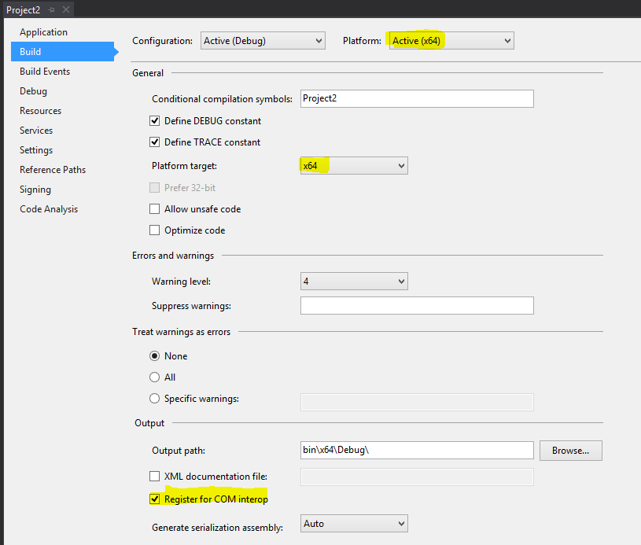
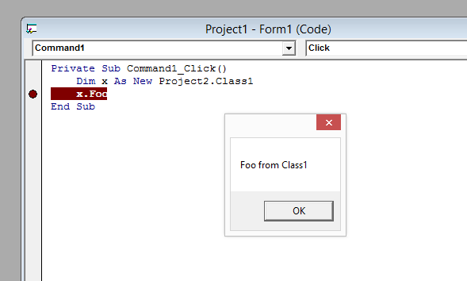
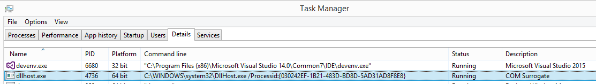

# Using 64 Bits Dlls from a 32 Bits App

If you are doing a VB6 migration it is usually better to migrate your application and all your dependencies at once.
But there might be scenarios where you need to perform your migration in stages.

If your are migrating your Application in pieces you can for example migrate all your ActiveX Dlls to .NET and still expose them 
thru COM. That way you can keep some of your VB6 assests and still take advantage of the migration.

However, what happens if after you migrate some of your ActiveX Dlls you need to retarget some of those Dlls to 64 bits. 

Usually that will make your assemblies incompatible with the VB6 app because VB6 is a 32-bit process.

But using [`DllSurrogates`](https://docs.microsoft.com/en-us/windows/win32/com/dll-surrogates), you can still comunicate your 32-bit VB6 App to your 64-Bit assemblies thru COM. This article is inspired by this [repo](https://github.com/rogerorr/DllSurrogate/).

Ok first we need some VB6 code.

We will have two VB6 Projects.
```
Project1.vbp 
  + Form.frm   
  
Project2.vbp
  + Class1.cls
```
  
So the first program has a form with a command button. And a Click Handler:

```VB
Private Sub Command1_Click()
    Dim x As New Project2.Class1
    x.Foo
End Sub
```

And the second program is just a class with a public sub Foo
```VB
Public Sub Foo()
  MsgBox "Foo from Class1"
End Sub
```

Ok if we Upgrade `Project2` to C#

We will get something like this:

```C#
using System;
using System.Runtime.InteropServices;
using System.Windows.Forms;

namespace Project2
{
    [Guid("D7B47BAF-CDB1-41AA-BA3A-FD734121DD16")]
    [ComVisible(true)][ProgId("Project2.Class1")][ClassInterface(ClassInterfaceType.AutoDual)]
	public class Class1
	{

		public void Foo()
		{
			MessageBox.Show("Foo from Class1 ");
		}
	}
}
```

Ok. Perfect so we are not ready to start setting up the COM Surrogate.

Before we continue, make sure that you have setup your migrated project to be a 64 bit assembly and expose it thru COM. Go to Project2 Properties and verify that:
* Active Platforms is x64
* Platform target is x64
* Make sure that the Register for COM Interop option is checked (You might need to run Visual Studio as administrator).



Ok. If you rebuild your project and your 64 bit assembly is compiled and registered, follow these steps.

1. Start a new "Developer Command Prompt" as a Administrator
2. From an administrator command prompt run:
```
C:\Windows\Microsoft.NET\Framework64\v4.0.30319\RegAsm.exe C:\COM3264_.Net\Upgraded\bin\x64\Debug\Project2.dll /codebase
```
> Note: Notice that I used the regasm version inside `C:\Windows\Microsoft.NET\Framework64` 

> Note: you are likely to get a warning about registering an unsigned assembly - we are not concerned about that for the purposes of this demonstration.

3. Configuring the COM object to use DllHost

In order to make use of the standard DllHost mechanism we simply need to add a couple of registry keys to the system. Microsoft have used the term "DllSurrogate" for this mechanism and this name is used in one of the values written into the registry.

We need to add a new value to the CLSID for the class(es) affected and this change must be made in the 64-bit area of the registry. We must then also define a new application with a blank DllSurrogate.

In our example the target CLSID is {D7B47BAF-CDB1-41AA-BA3A-FD734121DD16} (the GUID we provided for our COM class in the C# source code) and we need to create a new GUID for our DLL surrogate*. 

3.1 Create new GUID for the DllSurrogate
C:> uuidgen -c
030242ef-1b21-483d-bd8d-5ad31ad8f8e8

3.2 Add an AppID value to the (64-bit) class ID 
```
c:\windows\system32\reg.exe add HKCR\CLSID\{D7B47BAF-CDB1-41AA-BA3A-FD734121DD16} /v AppID /d " {030242ef-1b21-483d-bd8d-5ad31ad8f8e8}"
```

3.3 Create a new AppID
```
reg.exe add HKCR\AppID\{030242ef-1b21-483d-bd8d-5ad31ad8f8e8} /v DllSurrogate /d ""
```

Now we can successfully use the COM object from the 32-bit VB6




# How does it work?

If you use the task manager or some similar tool to examine the processes running in the computer you will see an instance of the Dllhost.exe process start and then disappear after a few seconds.



The command line for DllHost contains the CLSID of the target class and this (32-bit) process actually creates the 32-bit COM object using this CLSID and makes it available to the calling application, using cross-process marshalling for the calls between the 32-bit application and the 64-bit target object.

When the COM object is destroyed, DllHost hangs around for a few seconds, ready for another process to create a COM object. If none does it times out and exits.

## Some differences from in-process COM objects

There are a number of differences between a 'normal' in-process COM object and this externally hosted object.

The first obvious difference is that each call into the COM object now has to marshall data between the calling process and the DllHost process. This is obviously going to introduce a performance overhead. It is hard to tell how significant this performance overhead will be; it depends on the 'chattiness' of the COM interface and the sizes of the data items being passed around.

Some COM interfaces pass non-serialisable values around (for example, pointers to internal data structures) and these will require additional support of some kind to work successfully in the Dll surrogate environment.

Another difference is that the same DllHost process may host COM objects for a number of different applications at the same time. While this is perfectly valid according to the rules of COM, there are a number of cases where problems can arise - for example if the implementation makes assumptions about being able to share internal data between separate COM objects.

Additionally, some in-process COM objects are written with some assumptions that the calling application code is in the same process as the COM object. For example, the name of a log file might be based on the name of the application. This may be an insurmountable problem for using this solution, although if the COM interface is in your control you might be able to enhance it to provide additional methods to support out-of-process operation.

## Multiple classes

If your COM DLL provides a number of different COM classes, you might wish to host them all inside the same DllHost instance. You can do this by using the same AppID for each class ID; the first COM object created will launch the DllHost and each additional object created by the application will simply bind to an object in the same DllHost.

## Calling 32-bit COM objects from 64-bit applications

The commonest use case for Dll surrogates is allowing a legacy 32-bit COM object to used in a new 64-bit application, but the same mechanism does work in the other direction, although it is less common for this to be necessary.

You need to add the same registry keys as above, but this time the CLSID will be the one in the 32-bit registry hive so you will use the 32-bit reg.exe from the directory `C:\Windows\syswow64`.
